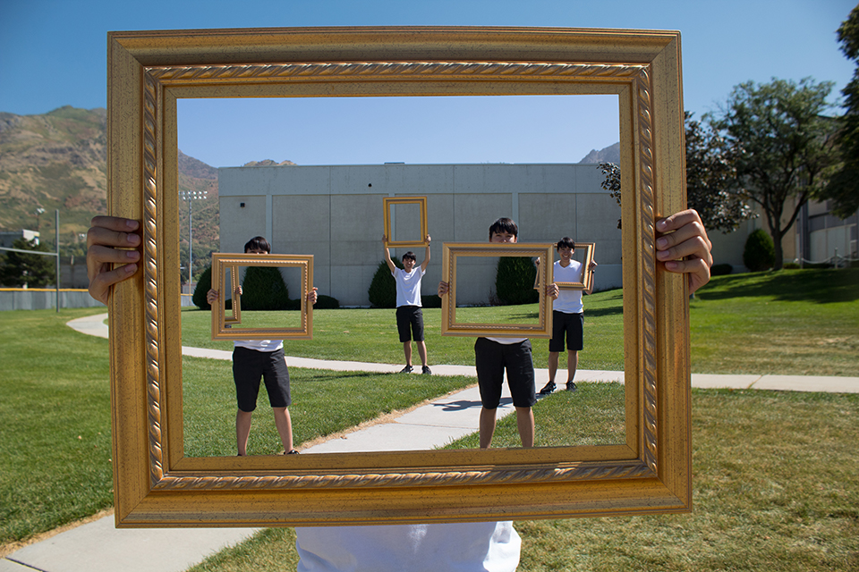
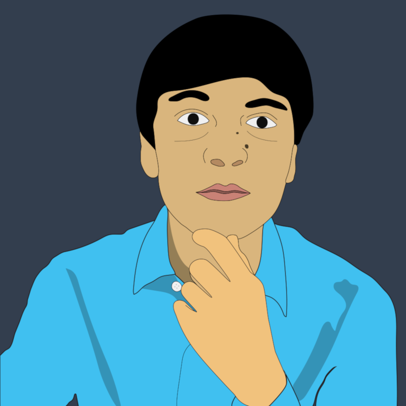
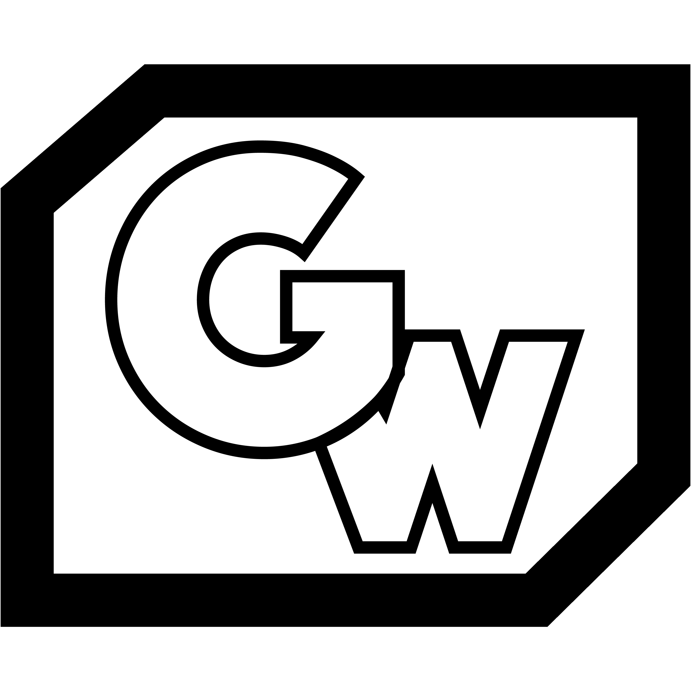
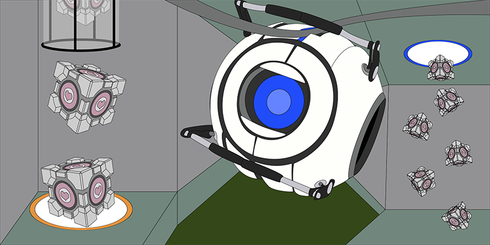

# Portfolio
---

## Raster
---

### Frames:

## Vector
---

### Profile Picture:

### GW Logo:

### Portal 2 Scene:

## Video
---
## Audio
---



# Programming
## Shape Calculator
[Shape Calculator](https://github.com/InDus7ry/Operation-Portfolio/tree/master/Programming/ShapeCalculator)
## Question Machine
[Question Machine](https://github.com/InDus7ry/Operation-Portfolio/tree/master/Programming/writeFiles)
