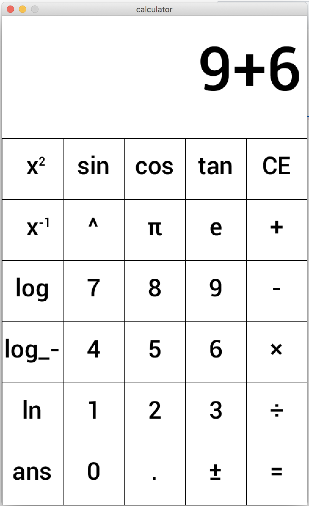

# Portfolio
---

## Raster
---

### Frames:

## Vector
---

### Profile Picture:

### Portal 2 Scene:

## Video
---

<iframe width="560" height="315" src="https://www.youtube.com/embed/i_FUt5bN6zg" frameborder="0" allow="accelerometer; autoplay; encrypted-media; gyroscope; picture-in-picture" allowfullscreen></iframe>

## Audio
---



# Programming
## Shape Calculator
[Shape Calculator](https://github.com/InDus7ry/Operation-Portfolio/raw/master/Programming/ShapeCalculator/ShapeTester.zip)
## Question Machine
[Question Machine](https://github.com/InDus7ry/Operation-Portfolio/raw/master/Programming/writeFiles/writeFiles.zip)
## Processing Calculator
[Processing Calculator](https://github.com/InDus7ry/Operation-Portfolio/raw/master/Programming/Calculator/calculator.zip)

